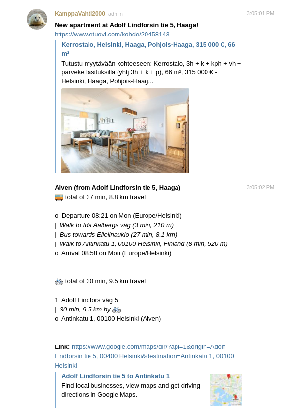

An Azure Function or Heroku cron task to check for new Etuovi emails in GMail and send links of apartments to Telegram



## Setup

### 1. Create .env file and fill in the values

```bash
cp .env-sample .env
```

- `TELEGRAM_BOT_TOKEN`: string (not base64 encoded) of [Telegram bot](https://core.telegram.org/bots) token.
- `TELEGRAM_BOT_CHANNEL`: string (not base64 encoded) of [Telegram channel](https://core.telegram.org/bots) ID.

    For group chats: invite bot to a channel, make the channel a super group, promote bot as admin (so they can post there), and run:

    ```
    curl "https://api.telegram.org/bot$TELEGRAM_BOT_TOKEN/getUpdates"
    ```

    There you can see the chat id of the group, that is the one needed.


- `CREDENTIALS`: base64 encoded object of GMail OAuth2 client secrets. See `credentials.json` in [https://developers.google.com/gmail/api/quickstart/nodejs](https://developers.google.com/gmail/api/quickstart/nodejs).

- `ACCESS_TOKEN`: base64 encoded object of GMail OAuth2 access and refresh token. See `token.json` in [https://developers.google.com/gmail/api/quickstart/nodejs](https://developers.google.com/gmail/api/quickstart/nodejs). Needed scopes are:

  ```json
  [
    "https://www.googleapis.com/auth/gmail.readonly",
    "https://www.googleapis.com/auth/gmail.modify",
    "https://www.googleapis.com/auth/gmail.send"
  ]
  ```

  `gmail.send` is only needed if you enable PDF downloading.

- `GOOGLE_MAPS_KEY`: string (not base64 encoded) of Google Maps API key. You need to enable Directions API and add API Key credentials in Google Cloud Console. See https://developers.google.com/maps/documentation/directions/start

  Note that Google Directions API might cost in high volumes. The cost should be very minimal unless you are doing thousands of queries.

- `REDIS_URL`: string (not base64 encoded) of Redis connection URL. Redis is used to save sent messages into a store because Telegram doesn't allow message history access as a bot.

**Optional setup**

If you want the bot to send PDF snapshots of the Etuovi apartment pages for archiving:

- `SAVE_APARTMENT_PDFS=true` to enable PDF saving
- `PDF_API_URL`: The base url where [url-to-pdf-api](https://github.com/alvarcarto/url-to-pdf-api) service is hosted. The service is easiest to get running with the Deploy to Heroku button in the repository. The public demo is limited to certain urls, so self-hosted version is needed.
- `PDF_API_TOKEN`: Token for Url to PDF API (sent as `x-api-key`)

This is useful to refer back to previous apartments: what you liked about them and what you didn't.

### 2. Edit the places

Edit ([places.ts](CheckForNewApartments/places.ts)) to locations you are often traveling from your apartment. Could be your work via car, hobby via bicycle, etc. Waypoints can be added but please note that Google doesn't support them in public transit. The arrival time can be spcified for public transit (for example 9AM Monday).

### 3. (Optional) Install the [Azure Functions Core Tools](https://github.com/Azure/azure-functions-core-tools)

[Azure Functions Core Tools](https://github.com/Azure/azure-functions-core-tools) are needed if you use Azure functions for hosting.

### 4. Install dependencies

```bash
npm i
```

### 5. Setup Etuovi.com

Create an apartment watch with email notification in https://www.etuovi.com.

You can enable:

* New apartment or change notifications
* New apartment showing notifications

The bot will remember all apartments it has sent to the channel, and only calculate the routes once. 
For updates (changes or showings), it will send a reply to the original message like in the screenshot:


This makes the messaging less spammy.

## Run locally

* `docker-compose up -d` to start Redis server.
* `npx ts-node ./scripts/checkForApartments.ts`

### Clearing redis

`npx ts-node ./scripts/clearRedis.ts`

## Deploy to Azure

1. Create an Azure Function app and deploy the app there (log in first to `az` cli):

```bash
npm i
npm run build:production
func azure functionapp publish <appname>
```

2. Configure the same env variables in `.env` to the function app


## Deploy to Heroku

1. Create Heroku app
1. Add environment variables
1. Add Heroku Scheduler add-on, and configure `node -r ts-node/register --max-old-space-size=2048 ./scripts/checkForApartments.ts` as the task with comfortable interval.
1. Add Papertrail add-on for browsing logs easily from browser
1. Add new git remote for the Heroku app, for example `git remote add prod git@heroku.personal:my-app.git`. *(Requires heroku.personal host to SSH config as well.)*
1. `git push prod`
